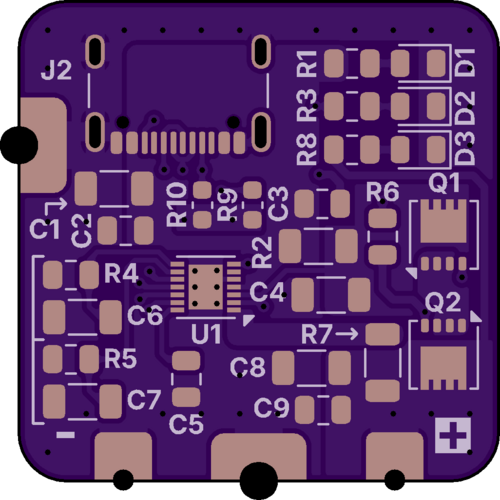
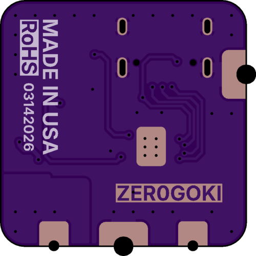

# PD 3.1 + Step Down Power Board

A power board designed to negotiate up to 28V @ 5A using USB Power Delivery 3.1 standard with onboard regulators for steady +24V and +5V outputs. 

Based on the AP33771C reference design by Diodes Incorporated.

## PCB Specs
- 0.8mm-1.6mm PCB

- 1oz-2oz Copper

- ENIG

>[!IMPORTANT]
> Use 2oz copper for ≤ 5A
>
> Use 1oz copper for ≤ 1.5A

## BOM

## Version History

| Version | EDA | Changelog |
| ------------- | ------------- | ------------- |
| 05172026 | KICAD 10.0 | Added +24V and +5V onboard regulator. |
| 03142026 | KICAD 9.0 | First physical production run with OSHPARK. |

| Version | Front | Rear |
| :---: | :---: | :---: |
| 05172026 |  |  |
| 03142026 |  | |
